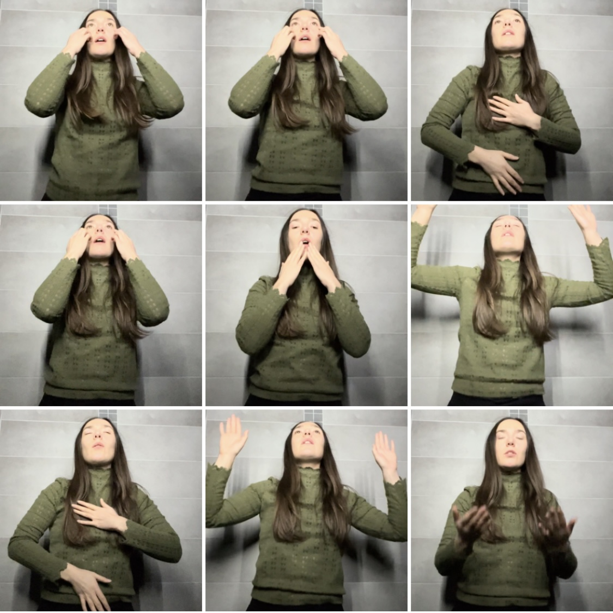

# Aria and the Curtain

_Aria and the Curtain_ is a publicly readable digital opera libretto written by [Katarina Ranković](https://www.youtube.com/katdrinktea). 

This site is the home of the [libretto](libretto.md). 

Throughout the libretto, you will find links to clips of Katarina singing and performing simple choreographies. These clips are illustrative only and are presented as sketches or notation to be further interpreted by composers, directors and singers. 

!!! quote "Blurb"
    *Imagine an opera in which the hero is neither a dragon-slaying prince, nor a tragic courtesan, but Song itself: breathed into life by the very act of human singing. Over time and over lives, Song arrives, departs, evolves, fragments, distributes, converges: the same Song, yet different.*

    *Song happily contradicts itself, moves and is moved, writes and is written. It bursts from the mouths it outlives in spontaneous passion, yet precedes the bodily organs that produce it. So where and when is Song? The answer, it turns out, also answers the question: where and when are You?*
